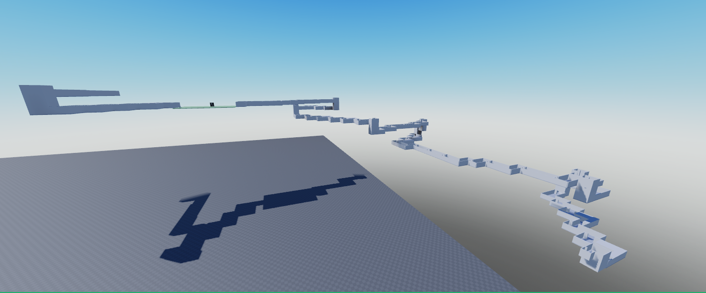
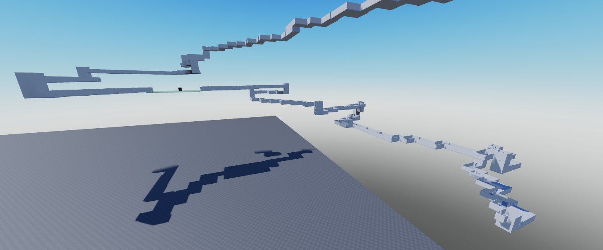
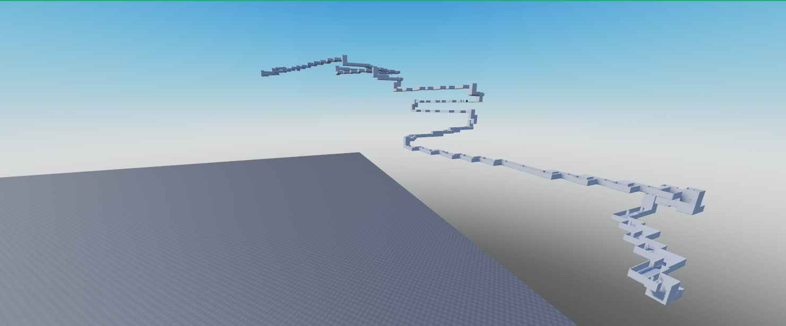

# Deterministic Dungeon Generator (DOORS-inspired)

Procedual dungeon generation with deterministic seeds, collision-safe placement.

## Features
* Seeded generation
* Collision validation
* Modular room system
* Backtracking support (in case it gets completely stuck)

## Videos & Images
#### Showcase:

#### Seeded generation example:

SEED 5 / 60 ROOMS

SEED 5 / 120 ROOMS (you can see that the first 60 rooms stay the exact same)

SEED 10 / 120 ROOMS (entirely different dungeon)

More to come later!
